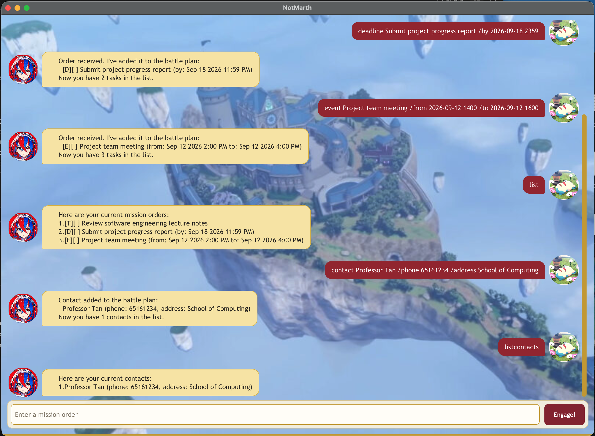

# NotMarth User Guide

**NotMarth** is your supportive tactical companion for managing tasks and tutor contacts offline.
Build a battle plan, track completed mission orders, and keep useful contact details close at hand.



## Quick start

1. Ensure that Java 25 or later is installed.
2. Place `notmarth.jar` in the folder where you want NotMarth to keep its data.
3. Open a terminal in that folder and run:

   ```bash
   java -jar notmarth.jar
   ```

4. Type a command in the input box and press <kbd>Enter</kbd> or click **Engage!**.

NotMarth saves your battle plan automatically in `data/notmarth.txt`. Your tasks and contacts will be
restored the next time you start the application from the same folder.

> [!TIP]
> Commands use single spaces and are case-sensitive. Parameters in angle brackets, such as
> `<description>`, are values for you to replace; do not type the angle brackets.

## Features

### Add tasks

NotMarth supports three kinds of mission orders:

| Task type | Format | Example |
| --- | --- | --- |
| To-do | `todo <description>` | `todo Polish the Emblem rings` |
| Deadline | `deadline <description> /by <date or time>` | `deadline Submit report /by 18/09/2026 2359` |
| Event | `event <description> /from <start> /to <end>` | `event Strategy council /from 2026-09-20 1400 /to 2026-09-20 1600` |

Dates can use `yyyy-mm-dd` or `dd/MM/yyyy`. Add a 24-hour time as `HHmm` or `H:mm` when needed.
For example, `2026-09-18 2359` and `18/09/2026 23:59` are both accepted.

### View and find tasks

- `list` — show every task and its number.
- `find <keyword>` — show tasks whose descriptions contain the keyword.
- `on <date>` — show deadlines and events scheduled on that date.

Examples:

```text
list
find report
on 18/09/2026
```

### Update tasks

Use the task number shown by `list`:

- `mark <task number>` — mark a task as complete.
- `unmark <task number>` — mark a task as incomplete.
- `delete <task number>` — remove a task.

For example, `mark 2` completes task 2. Task numbers can change after a task is deleted, so run `list`
before issuing your next order.

### Manage contacts

Add a contact with their name, phone number, and address:

```text
contact Vander /phone 65161234 /address Somniel Training Yard
```

The phone number may contain digits, spaces, `+`, `-`, and parentheses.

- `listcontacts` — show every contact and its number.
- `findcontact <keyword>` — find contacts by name.
- `deletecontact <contact number>` — remove a contact.

Contact numbers are separate from task numbers. As with tasks, list the contacts again after deleting one
to see their current numbers.

### Exit NotMarth

Enter `bye` to end the session. Your latest battle plan has already been saved automatically.

## Command summary

| Command | Purpose |
| --- | --- |
| `todo <description>` | Add a to-do |
| `deadline <description> /by <date or time>` | Add a deadline |
| `event <description> /from <start> /to <end>` | Add an event |
| `list` | List all tasks |
| `find <keyword>` | Find tasks by description |
| `on <date>` | List deadlines and events on a date |
| `mark <task number>` | Mark a task as complete |
| `unmark <task number>` | Mark a task as incomplete |
| `delete <task number>` | Delete a task |
| `contact <name> /phone <number> /address <address>` | Add a contact |
| `listcontacts` | List all contacts |
| `findcontact <keyword>` | Find contacts by name |
| `deletecontact <contact number>` | Delete a contact |
| `bye` | Exit NotMarth |
